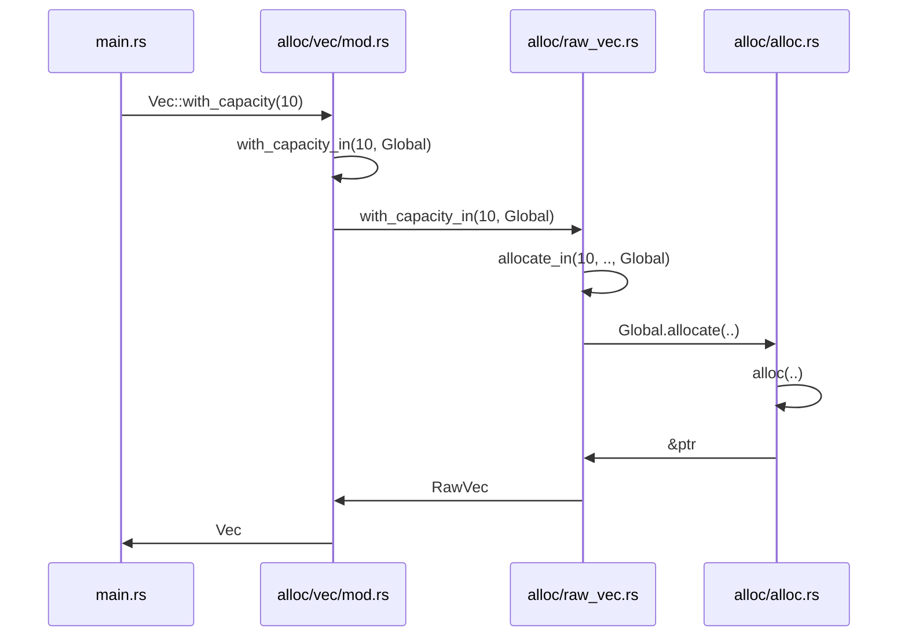
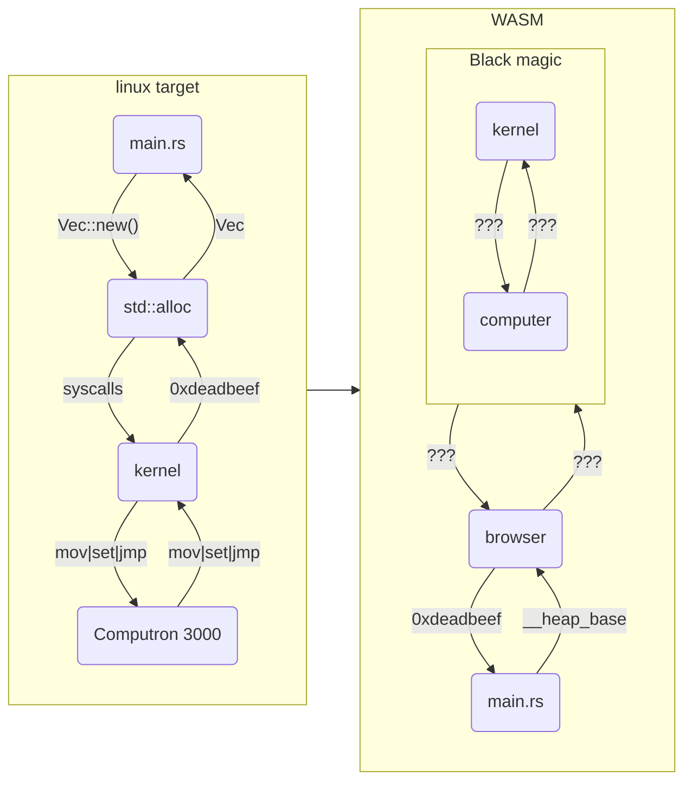

# What the WASM

Demistfying Web Assembly, how it works, and more‽

---
layout: center
---

<style>
.container {
  display: grid;
  grid-template-columns: 1fr 1fr;
  gap: 20px;
}
.key {
  text-align: right;
  font-weight: 600;
}
</style>

<div class="container">
  <div class="key">Question</div>
  <div>What <em>is</em> WASM?</div>
  <div v-click class="key">Answer</div>
  <div v-click>
    Web assembly<br /><br />
    <code>&#60;/talk&#62;</code>
  </div>
</div>

---
layout: image-left
image: ./yew.png
---

## How did we get here?

<v-clicks>

Playing with some Rust

"Huh Rust on the frontend..."

...But...how?

<hr class="my-10">

What would I even use web assembly for?

How does web assembly even?

Rewind: How does assembly even?

</v-clicks>

<!--
- Found a rust framework for frontend (yew.rs)
- That looks pretty cool
- Oh web assembly, nice, but i'm sure this isn't only what it's designed for
- {slide}

- So, let's get to the root and come back
-->

---
layout: image-right
image: ./assembly.JPG
---

## Contents

<p v-click>Rewind: How does assembly even?</p>

---

## What even _is_ Assembly?

CPUs are <span class="text-green-500">**smart**</span> dumb things

<div class="py-4">

<v-clicks>

- CPUs only understand specific instructions
- We want to do "instructions"
- `1 || 0 || "what?"`

</v-clicks>

</div>

<div class="text-xl" v-click>

Assembly: A human readable verison of the raw machine instructions*

<footer>
  <sup>*: This comes with many more asterisks</sup>
</footer>

</div>


<!--
Trust: This is actually going to help us later
-->

---
layout: fact
---

# CPUs are smart <span class="text-green-500">**dumb**</span> things

How can we ever be memory safe if everything is just a CPU instruction?

<!--
If an instruction is: "Load value from memory into register X", how could we ever make that secure?

We need an example application. How does this work in "reality"
-->

---
layout: cover
---

## Hello Memory!

```rust{all|3|4|6-8|10-12|13|all|4|7|11}
const ARR_LEN: usize = 10;

pub fn main() {
    let mut array = vec![0; ARR_LEN];

    for (i, v) in array.iter_mut().enumerate() {
        *v = i * 2;
    }

    for v in array.iter() {
        println!("{}", v);
    }
}
```

<!--
Let's take an example, and see what it does

Our app:
- declares some dynamic memory for an array
- fills that array with the index * 2
- prints each item in that array (backwards)
- cleans up the app (freeing the memory, and exiting)

But:
- How does memory allocation even?
- What is printf even printing to? What is STDOUT?
- free the memory? free it back to what/whom?

Answers: Thank you libraries!
-->

---
layout: cover
---

## Hello Memory! (with less secrets)

```rust{all|1|3-7|7,12-13}
#![no_std]

extern crate std;
use std::io;
use std::io::prelude::*;
use std::string::ToString;
use std::vec::Vec;

const ARR_LEN: usize = 10;

pub fn main() {
    let mut array: Vec<usize> = Vec::with_capacity(ARR_LEN);
    array.resize(ARR_LEN, 0);

    for (i, v) in array.iter_mut().enumerate() {
        *v = i * 2;
    }

    for v in array.iter() {
        io::stdout().write(&v.to_string().as_bytes()).unwrap();
        io::stdout().write(&[10]).unwrap();
    }
}
```

<!--
- Removing the macros uncovers the truth
- Note: Not all of this is "true"**
- By removing the std crate, we will see everything we need
- e.g. we need to bring in std, and import everything we need
- Our vector is just a resized vector
- Our output is writing byte streams to stdout
-->

---

## Follow the rabbit



<!--
Following the source of it all.
Vec => RawVec => Alloc
-->

---

## How does `Global.alloc` even?

[From the docs](https://doc.rust-lang.org/alloc/alloc/trait.Allocator.html#tymethod.allocate)

<blockquote>

```rust
fn allocate(&self, layout: Layout) -> Result<NonNull<[u8]>, AllocError>
```

Attempts to allocate a block of memory.

On success, returns a NonNull<[u8]> meeting the size and alignment guarantees of layout.

The returned block may have a larger size than specified by layout.size(), and may or may not have its contents initialized.

</blockquote>

<v-click>

Answer:

> <br>
> "It depends"<br><br>
> &nbsp;&nbsp; - Software Engineers, circa. The dawn of time<br>
> &nbsp;


</v-click>

---

## But really

_Attempts to allocate a block of memory_

A.K.A: Malloc and Friends!*

<v-click>

<hr class="mt-3 mb-3">

### And an over simplification:

</v-click>

<v-clicks>

<p>

`Your code` "Hey `malloc`, give me some some memory"

</p>

<p>

`Malloc` .oO ( I seem to be fresh out of spare memory )

</p>

<p>

`Malloc` "Hey `<system>` can I have some memory?" `mmap|brk`

</p>

<p>
 
`System` "Sure just be sure to return it later" `#deadbeef`

</p>

<p>

`Malloc` "Hey code have some memory" `&ptr`

</p>

<p>

`Your code` "Cool"

</p>

</v-clicks>

<footer>
 <sup>* There are so many extra asterisks here</sup>
</footer>

<!--
What this all means:
- Our code talks with libraries that talks to malloc
- Malloc talks to our system, and gets memory and manages it for us
-->

---

## BUT WHY DOES THIS MATTER?

Code = Assembly = Machine Instructions = Control the Computron... Right?

<v-click>

Well.. sort of yes, sort of no.

```mermaid {theme: 'dark', scale: 0.7}
sequenceDiagram
  participant C as code.rs
  participant L as std::alloc
  participant K as kernel
  participant M as Computron 3000

  C->>L: Vec::new()
  rect rgb(33, 33, 33)
  note over L: Black Magic
  L->>K: mmap [syscall]
  K->>M: mov|jump|etc
  M->>K: mov|jump|things
  K->>L: 0xdeadbeef (ptr)
  end
  L->>C: Vec<T>
```

</v-click>

<v-click>



</v-click>

<!--
- Kernels/System APIs are generally always in the middle
- Kernels and systems make sure things like multitasking can happen, drivers work, all that cool stuff
- Our code is interacting a lot with kernels, we never directly get memory ourselves.

Why is this relevant? Because compilers compile to a target. In linux, malloc will do sys calls.
In web assembly.....???

The full path:
- application calls malloc
- library implements malloc to use syscalls
- sys call returns some memory address to library
- the library manages that block of memory
- Our code manages that block
-->

---

## Summary

<div class="py-4">

> Rewind: How does assembly Even?

</div>

<v-clicks>

<p>

**Q: What is assembly?**

_A: It's a human readable verison of machine instructions to control our CPU_

</p>

<p>

<hr>

Q: How is this eventually safe (e.g memory)?

_A: `syscall`s and trusting the kernel to manage it_

</p>

<p>

<hr>

Q: But how does our code know to use those `syscall`s / Aren't they target specific?

_A: Libraries! Libraries everywhere, and YES_

</p>

</v-clicks>

<!--
We started talking about assembly, and how does that work. We moved to how we allocate memory, why does this matter?
We the last slide we see std::alloc is talking to our system (a kernel in this case).
e.g. sometimes we are just talking to a kernel instead of talking to the cpu directly.

-->

---

## But before we move on, some fun things (AKA headaches)

Did you know?

<v-clicks>

- You can write your own malloc/allocator
- Rust was using jemalloc everywhere until 2018 when it started to use the "system provided allocator"
- It would be fun, but you probably shouldn't think about doing this

</v-clicks>

---
layout: fact
---

## What if we had _one_ kernel that was understood by _all_ platforms, and could run things _anywhere_?

---
layout: image-right
image: ./assembly.JPG
---

## Contents

<p v-click-hide class="faded-hide">Rewind: How does assembly even?</p>
<p v-after>How does web assembly even?</p>

---
layout: quote
---

# Let's forget Assembly for a moment

---
layout: iframe-right
url: /what-the-wasm/frame/hello-wasm.html
---

# Hello WASM

```rust{0|all}
#[no_mangle]
pub extern "C" fn add1(i: i32) -> i32 {
    i + 1
}
```

```js{0|1-11|12-17}
let adder;
async function init() {
  const { instance } =
    await WebAssembly.instantiateStreaming(
      fetch("./add1.wasm")
    );

  adder = instance.exports.add1;
}
init();

const count = document.getElementById("count");
document.getElementById("add")
  .addEventListener("click", () => {
    const val = +count.innerHTML;
    count.innerHTML = adder(val);
  });
```

<!--
Description:
- We have a page
- We click a button, the counter goes up
- But it's controlled through this C code instead! (well the adding is)

And this is the JS that's driving it:
- We load the wasm file, and assign our adder
- Then on every button click, we get the value of the box, and set it to the result of our added
-->

---
layout: two-cols
---

## Where did `add1.wasm` come from?

```rust{all|5-8}
// add1.rs
#![no_std]
#![no_main]

#[no_mangle]
pub extern "C" fn add1(i: i32) -> i32 {
    i + 1
}

#[panic_handler]
fn panic(_panic: &core::panic::PanicInfo<'_>) -> ! {
    loop {}
}
```

And some compilation:
```sh
rustc --target wasm32-unknown-unknown \
  -Copt-level=3 \
  -Clto \
  add1.rs
```

::right::

`wasm2wat add1.wasm`

```wasm{0|all|3-6}
(module
  (type (;0;) (func (param i32) (result i32)))
  (func $add1 (type 0) (param i32) (result i32)
    local.get 0
    i32.const 1
    i32.add)
  (memory (;0;) 16)
  (global $__stack_pointer (mut i32) (i32.const 1048576))
  (global (;1;) i32 (i32.const 1048576))
  (global (;2;) i32 (i32.const 1048576))
  (export "memory" (memory 0))
  (export "add1" (func $add1))
  (export "__data_end" (global 1))
  (export "__heap_base" (global 2)))
```

<!--
- Generation command
- Use wasm2wat to generate some human readable wasm
- This is our actual function in web assembly
-->

---
layout: two-cols
---

## Memory - EXPOSED

```wasm{all|7,9-10,13-14}
(module
  (type (;0;) (func (param i32) (result i32)))
  (func $add1 (type 0) (param i32) (result i32)
    local.get 0
    i32.const 1
    i32.add)
  (memory (;0;) 16)
  (global $__stack_pointer (mut i32) (i32.const 1048576))
  (global (;1;) i32 (i32.const 1048576))
  (global (;2;) i32 (i32.const 1048576))
  (export "memory" (memory 0))
  (export "add1" (func $add1))
  (export "__data_end" (global 1))
  (export "__heap_base" (global 2)))
```

::right::

<div class="py-10"></div>

<v-clicks>

- Assembly: we were making syscalls for malloc
- WASM: we have access to these variables which define the size/location of our stack/heap

<p>

Stack Size = `__heap_base` - `__data_end`

</p>

<p>

Heap size = `__heap_base` => ∞

</p>

</v-clicks>

---

## Spot the difference



<!--
In the first part of this talk, we had a graph similar to this.
 -> code => lib => kernel => cpu
In our web assembly world, we just have memory. huh?


Congratulations, our WASM doesn't have the stdlib.h!
-->

---

## `#![no_std]` and WASM

Rust's stdlib is super powerful, but they might be lacking support in WASM:

<v-clicks>

- `std::fs::File` - read/write files
- `std::path` - cross platform file paths
- `std::net` - relied upon by `http`, `reqwest`
- `std::thread` - spawning threads
- `std::ffi` - interface all those other shared libs

</v-clicks>

<v-click>

<hr v-click class="my-6">

Alternatives:

</v-click>

<v-clicks>

- Use the parts of `std` or `core` that do work in WASM (e.g. `std::alloc` works!)
- Emscriptem if you want to emulate unix
- Wait for WASI to be a real thing
- Rely on `web-sys` and `wasm-bindgen` as much as possible in the interim

</v-clicks>


<!--
e.g. `use std::path` knows about a `/var/log/hello.log` and `C:\logs\hello.log`. But what is a `Path` in WASM?
WASM gives you enough Assembly to write algorithms, but io/net/threads might be what you expect.

WASM has the ideals of "new native" performance. So how fast really is it?
-->

---
layout: iframe-right
url: /what-the-wasm/frame/speed.html
---

## Software drag racing 

`sum-reduce.js`

```js
const sumReduce = (to) => {
  let total = 0;
  for (let i = 0; i < to; i++) {
    total += i;
  }
  return total;
}
```

`sum_reduce.rs`

```rust
pub extern "C" fn sum_reduce(to: i64) -> i64 {
    let mut total: i64 = 0;
    for i in 0..=to {
        total += i
    }
    total
}
```

---
layout: fact
---

In short:

## It's heckin' fast when used properly

---
layout: image-right
image: ./assembly.JPG
---

## Contents

<p class="faded">Rewind: How does assembly even?</p>
<p v-click-hide class="faded-hide">How does web assembly even?</p>
<p v-after>What would even use web assembly for?</p>

---
layout: cover
---

## Play Doom?

Speaking of Emscriptem: https://wadcmd.com/

---
layout: center
---


---

## Speaking of bad ideas

<v-clicks class="mt-5">

- ~91% users with browser support (caniuse.com)
- Do you Rust? On ThE fRoNtEnD?!?!
- Libraries libraries libraries

</v-clicks>

<v-click>

<hr class="my-5">

But Yew want to yews this: https://yew.rs/

</v-click>

<v-click>

<hr class="py-2">

**[MASSIVE OPINION]** Why even pick another language?

</v-click>

<v-clicks>

- ~~Perf?~~
- ~~Dev Ex~~ 
- ~~Time to production~~
- 📈📈📈 Expression 📈📈📈

</v-clicks>

<!--
Which langauge do we pick?
- Which language do we pick anyway in the real world?
  - Ruby/Python/Rust/Java/PHP/Javascript/Typescript backend?
  - Javascript/Typescript frontend?
-->

---
layout: center
---


---

## But some good opportunities

**AutoCAD**

> The AutoCAD web app uses emscripten to port pieces from the > 35 years old native application for AutoCAD.

**Figma**

> Because our product is written in C++, which can easily be compiled into WebAssembly, Figma is a perfect demonstration of this new format’s power.

**TensorFlow**

> WASM is generally much faster than JavaScript for numeric workloads common in machine learning tasks. Additionally, WASM can be natively decoded up to 20x faster than JavaScript can be parsed.

---

## JS without a browser = NodeJS, WASM without a browser = ??? 

<v-click>

Moot: NodeJS is nothing more than a browser without a UI, and with `io` libraries

</v-click>

<v-click>

<div style="display: flex; justify-content: space-between;" class="mt-10">
  
  
</div>

</v-click>

<v-click class="pt-20">

I swear it's not Java all over again

</v-click>

---
layout: cover
---

## Acknowledgements

Surma @dassurma 

- Specifically his article on [Compiling C to Web Assembly without Emscriptem](https://surma.dev/things/c-to-webassembly/index.html)
- https://surma.dev/

Ryan Lopopolo @_lopopolo

- Creator of Artichoke (Ruby on Rust), which targets WASM as a build target!
- https://www.artichokeruby.org/

Everyone on stackoverflow over the last million years asking questions like what I've tried to answer in this presentation

---
layout: cover
---

<style>
.my-auto {
  @apply text-2xl
}
</style>

- <logos-twitter /> @nzchicken - rarely
- <logos-github-octocat class="rounded-xl bg-white"/> /b-n - more commonly
- <logos-github-icon class="rounded-full bg-white" /> github.com/b-n/what-the-wasm - this talk
