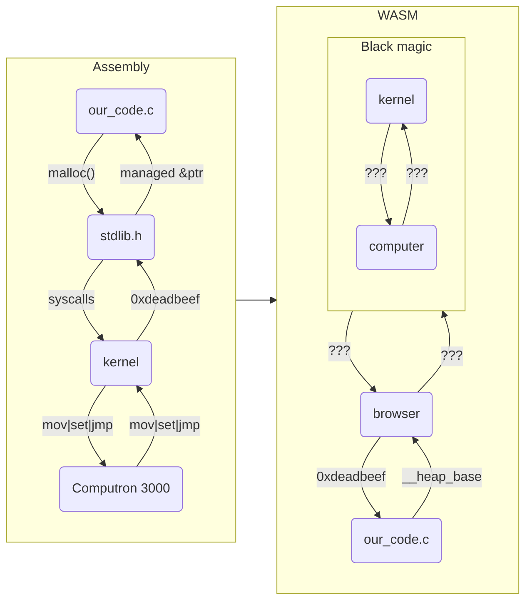

# What the WASM

Demistfying Web Assembly, how it works, and more‽

---
layout: center
---

<style>
.container {
  display: grid;
  grid-template-columns: 1fr 1fr;
  gap: 20px;
}
.key {
  text-align: right;
  font-weight: 600;
}
</style>

<div class="container">
  <div class="key">Question</div>
  <div>What <em>is</em> WASM?</div>
  <div v-click class="key">Answer</div>
  <div v-click>
    Web assembly<br /><br />
    <code>&#60;/talk&#62;</code>
  </div>
</div>

---
layout: image-left
image: ./yew.png
---

## How did we get here?

<v-clicks>

Playing with some Rust

"Huh Rust on the frontend..."

...But...how?

<hr class="my-10">

What would I even use web assembly for?

How does web assembly even?

Rewind: How does assembly even?

</v-clicks>

<!--
- Found a rust framework for frontend (yew.rs)
- That looks pretty cool
- Oh web assembly, nice, but i'm sure this isn't only what it's designed for
- {slide}

- So, let's get to the root and come back
-->

---
layout: image-right
image: ./assembly.JPG
---

## Contents

<p v-click>Rewind: How does assembly even?</p>

---

## What really _is_ Assembly?

CPUs are <span class="text-green-500">**smart**</span> dumb things

<div class="py-4">

<v-clicks>

- CPUs only understand specific instructions
- We want to do "instructions"
- `1 || 0 || "what?"`

</v-clicks>

</div>

<div class="text-xl" v-click>

Assembly: A human readable verison of the raw machine instructions*

<footer>
  <sup>*: This comes with many more asterisks</sup>
</footer>

</div>


<!--
Trust: This is actually going to help us later
-->

---
layout: fact
---

# CPUs are smart <span class="text-green-500">**dumb**</span> things

How can we ever be memory safe if everything is just a CPU instruction?


<!--
If an instruction is: "Load value from memory into register X", how could we ever make that secure?

We need an example application. How does this work in "reality"
-->

---
layout: cover
---

## Hello Memory! (and C!)

```c{all|6|4,7|8-10|12-14|16-17|all|7|13|16|1-2}
#include <stdio.h>
#include <stdlib.h>

const int ARR_LEN = 10;

int main() {
  int *array = malloc(ARR_LEN * sizeof(int));
  for (int i = 0; i < ARR_LEN; i++) {
    array[i] = i * 2;
  }

  for (int i = ARR_LEN - 1; i >= 0; i--) {
    printf("%d", array[i]);
  }

  free(array);
  return 0;
}
```

<!--
Our app:
- declares some dynamic memory for an array
- fills that array with the index * 2
- prints each item in that array (backwards)
- cleans up the app (freeing the memory, and exiting)

But:
- How does malloc even?
- What is printf even printing to? What is STDOUT?
- free the memory? free it back to what/whom?

Answers: Thank you libraries!
-->

---

## Getting to the brain cells!

**Example**: `void* malloc(size_t n)` AKA Our code wants memory!

What we know:

- We're on a shared system (e.g. many applications on one computer)
- We want some memory
- We want that memory to be safe

<v-click>

<hr class="mt-5">

`gcc -S -fverbose-asm malloc.c`

```asm{all|6}
# malloc.c:7:   int *array = malloc(ARR_LEN * sizeof(int));
	movl	$10, %eax	#, ARR_LEN.0_1
	cltq
	salq	$2, %rax	#, _3
	movq	%rax, %rdi	# _3,
	call	malloc@PLT	#
	movq	%rax, -8(%rbp)	# tmp97, array
```

</v-click>

<!--
⚠️ This is actually the most relevant slide about assembly
What we're trying to say with this:
- Assembly is instructions to the machine
- Our code actually doesn't call the CPU directly
- The kernel gets in the way, because the compiler is calling our shared malloc lib
- Kernel "makes it safe"


Why is this relevant? Because compilers compile to a target. In linux, malloc will do sys calls.
In web assembly.....???
-->

---

## DEEPER!

**Summary:**

1. Code => `malloc`
2. Library implements `malloc`
3. `malloc` allocates/returns "memory" (pointers!)

<v-click>

**But what does malloc\* do?**

- You want memory? Here's the address for some memory (pointer)
- "I don't have enough memory?" - Let me make a `syscall`\*\* and manage what comes back

<footer>
  <sup>
    *: Talking specifically about libc here
  </sup><br>
  <sup>
    **: Depending on the target arch
  </sup>
</footer>

</v-click>

<!--
Summary:
- Our code calls malloc
- Compiler makes sure that our code calls out to stdlib malloc function
- Malloc ensures we have some memory, and tells us where it is
-->

---

## FINALLY, the final boss: `syscall`s!

What memory can I use? => `syscall`

```mermaid {theme: 'dark', scale: 0.6}
sequenceDiagram
  participant C as code.c
  participant L as stdlib
  participant K as kernel
  participant M as Computron 3000

  C->>L: malloc()
  rect rgb(33, 33, 33)
  note over L: Black Magic
  L->>K: mmap [syscall]
  K->>M: mov|jump|etc
  M->>K: mov|jump|things
  K->>L: 0xdeadbeef (ptr)
  end
  L->>C: managed (ptr)
```

<v-click>



</v-click>

<v-click>

Our code (assembly) doesn't talk to the machine directly, we talk to the kernel!

</v-click>

<!--
How does malloc know what memory it can use? a syscall will get that from the kernel

The full path:
- application calls malloc
- library implements malloc to use syscalls
- sys call returns some memory address to library
- the library manages that block of memory
- Our code manages that block
-->

---

## Summary

<div class="py-4">

> Rewind: How does assembly Even?

</div>

<v-click>

**Q: What is assembly?**

</v-click>

<v-click>

_A: It's a human readable verison of machine instructions to control our CPU_

<hr>

</v-click>

<v-click>

Q: How is this eventually safe (e.g memory)?

</v-click>

<v-click>

_A: `syscall`s and trusting the kernel to manage it_

<hr>

</v-click>

<v-click>

Q: But how does our code know to use those `syscall`s / Aren't they target specific?

</v-click>

<v-click>

_A: Libraries! (e.g. libc, musl), Libraries everywhere, and YES_

</v-click>

---
layout: fact
---

# Assembly is cool, but kernels and compilers are cooler

---

## Bonus [headaches]

Did you know?

<v-clicks>

- You can write your own malloc function
- libc doesn't always follow the C standard
- Alpine linux uses `musl` instead of `libc`
- A bunch of libraries/applications [sometimes inadvertently] rely on special `libc` functionality and will give you many many headaches?

</v-clicks>

---
layout: image-right
image: ./assembly.JPG
---

## Contents

<p v-click-hide class="faded-hide">Rewind: How does assembly even?</p>
<p v-after>How does web assembly even?</p>

---
layout: quote
---

# Let's forget Assembly for a moment

---
layout: iframe-right
url: /what-the-wasm/frame/hello-wasm.html
---

# Hello WASM

```c{0|all}
int add1(int i) {
  return i + 1;
}
```

```js{0|1-11|12-17}
let adder;
async function init() {
  const { instance } =
    await WebAssembly.instantiateStreaming(
      fetch("./add1.wasm")
    );

  adder = instance.exports.add1;
}
init();

const count = document.getElementById("count");
document.getElementById("add")
  .addEventListener("click", () => {
    const val = +count.innerHTML;
    count.innerHTML = adder(val);
  });
```

<!--
Description:
- We have a page
- We click a button, the counter goes up
- But it's controlled through this C code instead! (well the adding is)

And this is the JS that's driving it:
- We load the wasm file, and assign our adder
- Then on every button click, we get the value of the box, and set it to the result of our added
-->

---
layout: two-cols
---

## Where did `add1.wasm` come from?

The Worls Most ~~Complex~~ Simple app:

`add1.c`

```c
int add1(int i) {
  return i + 1;
}
```

With some complex things:
```sh{all|1|2|5-6|8-9|3-4,7}
clang --target=wasm32 \
  -nostdlib \
  -O3 \
  -flto \
  -Wl,--no-entry \
  -Wl,--export-all \
  -Wl,--lto-O3 \
  -o add1.wasm \
  add1.c
```

::right::

`wasm2wat add1.wasm`

```wasm{0|all|5-8}
(module
  (type (;0;) (func))
  (type (;1;) (func (param i32) (result i32)))
  (func $__wasm_call_ctors (type 0))
  (func $add1 (type 1) (param i32) (result i32)
    local.get 0
    i32.const 1
    i32.add)
  (memory (;0;) 2)
  (global $__stack_pointer (mut i32) (i32.const 66560))
  (global (;1;) i32 (i32.const 1024))
  (global (;2;) i32 (i32.const 1024))
  (global (;3;) i32 (i32.const 1024))
  (global (;4;) i32 (i32.const 66560))
  (global (;5;) i32 (i32.const 0))
  (global (;6;) i32 (i32.const 1))
  (export "memory" (memory 0))
  (export "__wasm_call_ctors" (func $__wasm_call_ctors))
  (export "add1" (func $add1))
  (export "__dso_handle" (global 1))
  (export "__data_end" (global 2))
  (export "__global_base" (global 3))
  (export "__heap_base" (global 4))
  (export "__memory_base" (global 5))
  (export "__table_base" (global 6)))
```

<!--
- Generation command
- Use wasm2wat to generate some human readable wasm
- This is our actual function in web assembly
-->

---
layout: two-cols
---

## Memory - EXPOSED

```wasm{all|9,11,18,20}
(module
  (type (;0;) (func))
  (type (;1;) (func (param i32) (result i32)))
  (func $__wasm_call_ctors (type 0))
  (<our func>)
  (memory (;0;) 2)
  (global $__stack_pointer (mut i32) (i32.const 66560))
  (global (;1;) i32 (i32.const 1024))
  (global (;2;) i32 (i32.const 1024))
  (global (;3;) i32 (i32.const 1024))
  (global (;4;) i32 (i32.const 66560))
  (global (;5;) i32 (i32.const 0))
  (global (;6;) i32 (i32.const 1))
  (export "memory" (memory 0))
  (export "__wasm_call_ctors" (func $__wasm_call_ctors))
  (export "add1" (func $add1))
  (export "__dso_handle" (global 1))
  (export "__data_end" (global 2))
  (export "__global_base" (global 3))
  (export "__heap_base" (global 4))
  (export "__memory_base" (global 5))
  (export "__table_base" (global 6)))
```

::right::

<div class="py-10"></div>

<v-clicks>

- Assembly: we were making syscalls for malloc
- WASM: we have access to these variables which define the size/location of our stack/heap

<p>

Stack Size = `__heap_base` - `__data_end`

</p>

<p>

Heap size = `__heap_base` => ∞

</p>

</v-clicks>

---

## Spot the difference



<!--
In the first part of this talk, we had a graph similar to this.
 -> code => lib => kernel => cpu
In our web assembly world, we just have memory. huh?


Congratulations, our WASM didn't have the stdlib.h!
-->

---

## So... Let's just use stdlib!

<v-click>

**WAIT JUST ONE HOT DAMN MINUTE PARTNER**

</v-click>

<v-clicks>

- We have a pesky browser in the middle
- Our memory model is different
- Specifically: We don't have access to the kernel, so what is libc even going to do?

</v-clicks>

<hr v-click class="my-10">

<v-after>

Options:

</v-after>

<v-clicks>

- Write our own malloc
- Emscriptem

</v-clicks>

<v-click>

^-- Both of these topics are "another day" topics

</v-click>

<v-click>

Suffice to say:, WASM is a new form of ASM - that's designed to be cross platform

</v-click>

<!--
- This is where the WASM standard matters, and how people implement that standard

WASM has the ideals of "new native" performance. So how fast really is it?
-->

---
layout: iframe-right
url: /what-the-wasm/frame/speed.html
---

## Software drag racing 

`sum-reduce.js`

```js
const sumReduce = (to) => {
  let total = 0;
  for (let i = 0; i < to; i++) {
    total += i;
  }
  return total;
}
```

`sum_reduce.c`

```c
long long sum_reduce(int to) {
  long long total = 0;
  for (int i = 0; i <= to; i++) {
    total += i;
  }
  return total;
}
```

---
layout: fact
---

In short:

## It's heckin' fast when used properly

---
layout: image-right
image: ./assembly.JPG
---

## Contents

<p class="faded">Rewind: How does assembly even?</p>
<p v-click-hide class="faded-hide">How does web assembly even?</p>
<p v-after>What would even use web assembly for?</p>

---

## Play Doom?

Speaking of Emscriptem: https://wadcmd.com/

---

## On the frontend?

IMO, this is a "bad idea" [for now].

<v-clicks>

- ~95% browser support (caniuse.com)
- Do you Rust? On ThE fRoNtEnD?!?!
- Ecosystem

</v-clicks>

<v-click>

But Yew want to yews this: https://yew.rs/

</v-click>

<v-click>

<hr class="py-2">

**[MASSIVE OPINION]** Why even pick another language?

</v-click>

<v-clicks>

- ~~Perf?~~
- ~~Dev Ex~~ 
- ~~Time to production~~
- 📈📈📈 Expression 📈📈📈

</v-clicks>

<!--
Which langauge do we pick?
- Which language do we pick anyway in the real world?
  - Ruby/Python/Rust/Java/PHP/Javascript/Typescript backend?
  - Javascript/Typescript frontend?
-->

---
layout: center
---


---

## The backend of the frontend

Some examples/ideas:

- Autocad
- Figma
- Client-side neural networks (image recognition prior to upload)

---

## Where could we use this in Catawiki?

- Image adjustment/compression on the client - view changes live before submission
- Bid engine. is WASM better with websockets?
- `<your idea here>`

Note: Fallback support?

---

## Broadening horizons

If you can JS without a browser with NodeJS

THEN

You can WASM without a browser with wasmtime or wasmer

Why?

Single target, compiled on any platform, running on "any platform"

Wait for WASI though.

---

## Acknowledgements

Surma @dassurma - Specifically his article on [Compiling C to Web Assembly without Emscriptem](https://surma.dev/things/c-to-webassembly/index.html)

Ryan Lopopolo @_lopopolo - Creator of Artichoke (Ruby on Rust), which targets WASM as a build target!

Everyone on stackoverflow over the last million years asking questions like what I've tried to answer in this presentation
