# What the WASM

Demistfying Web Assembly, how it works, why it's cool

---
layout: center
---

<style>
.container {
  display: grid;
  grid-template-columns: 1fr 1fr;
  gap: 20px;
}
.key {
  text-align: right;
  font-weight: 600;
}
</style>

<div class="container">
  <div class="key">Question</div>
  <div>What <em>is</em> WASM?</div>
  <div v-click class="key">Answer</div>
  <div v-click>
    Web assembly<br /><br />
    <code>&#60;/talk&#62;</code>
  </div>
</div>

---

How my brain works:

1. I was learning Rust for "Fun"
2. I saw a Rust frontend framework - it was using WASM
3. Huh... I wonder...

Then: 

- What would I even use web assembly for?
- How does web assembly even?
- Rewind: How does assembly even?

TODO: Rustacean

<!--
- Found a rust framework for frontend (yew.rs)
- That looks pretty cool
- Oh web assembly, nice, but i'm sure this isn't only what it's designed for
- {slide}

- So, let's get to the root and come back
-->

---
layout: image-right
image: ./assembly.JPG
---

## Contents

<p v-click>Rewind: How does assembly even?</p>

---

## What really _is_ Assembly?

CPUs are <span class="text-green-500">**smart**</span> dumb things

<div class="py-4">

<v-clicks>

- CPUs only understand specific instructions
- We want to do "instructions"
- `1 || 0 || "what?"`

</v-clicks>

</div>

<div class="text-xl" v-click>

Assembly: A human readable verison of the raw machine instructions*

<footer>
  <sup>*: This comes with many more asterisks</sup>
</footer>

</div>


<!--
Trust: This is actually going to help us later
-->

---

## The conundrum

Our code => machine instructions

CPUs are smart <span class="text-green-500">**dumb**</span> things

If an instruction is: "Load value from memory into register X", how could we ever make that secure?

<!--
Slide, then:

We need an example application. How does this work in "reality"
-->

---

## Hello Memory! (and C!)

```c{all|6|4,7|8-10|12-14|16-17|all|7|13|16|1-2}
#include <stdio.h>
#include <stdlib.h>

const int ARR_LEN = 10;

int main() {
  int *array = malloc(ARR_LEN * sizeof(int));
  for (int i = 0; i < ARR_LEN; i++) {
    array[i] = i * 2;
  }

  for (int i = ARR_LEN - 1; i >= 0; i--) {
    printf("%d", array[i]);
  }

  free(array);
  return 0;
}
```

<!--
Our app:
- declares some dynamic memory for an array
- fills that array with the index * 2
- prints each item in that array (backwards)
- cleans up the app (freeing the memory, and exiting)

But:
- How does malloc even?
- What is printf even printing to? What is STDOUT?
- free the memory? free it back to what/whom?

Answers: Thank you libraries!
-->

---

## Getting to the brain cells!

**Example**: `void* malloc(size_t n)` AKA Our code wants memory!

What we know:

- We're on a shared system (e.g. many applications on one computer)
- We want some memory
- We want that memory to be safe

<v-click>

<hr class="mt-5">

`gcc -S -fverbose-asm malloc.c`

```asm{all|6}
# malloc.c:7:   int *array = malloc(ARR_LEN * sizeof(int));
	movl	$10, %eax	#, ARR_LEN.0_1
	cltq
	salq	$2, %rax	#, _3
	movq	%rax, %rdi	# _3,
	call	malloc@PLT	#
	movq	%rax, -8(%rbp)	# tmp97, array
```

</v-click>

<!--
⚠️ This is actually the most relevant slide about assembly
What we're trying to say with this:
- Assembly is instructions to the machine
- Our code actually doesn't call the CPU directly
- The kernel gets in the way, because the compiler is calling our shared malloc lib
- Kernel "makes it safe"


Why is this relevant? Because compilers compile to a target. In linux, malloc will do sys calls.
In web assembly.....???
-->

---

## DEEPER!

**Summary:**

1. Code => `malloc`
2. Library implements `malloc`
3. `malloc` allocates/returns "memory" (pointers!)

<v-click>

**But what does malloc\* do?**

- You want memory? Here's the address for some memory (pointer)
- "I don't have enough memory?" - Let me make a `syscall`\*\* and manage what comes back

<footer>
  <sup>
    *: Talking specifically about libc here
  </sup><br>
  <sup>
    **: Depending on the target arch
  </sup>
</footer>

</v-click>

<!--
Summary:
- Our code calls malloc
- Compiler makes sure that our code calls out to stdlib malloc function
- Malloc ensures we have some memory, and tells us where it is
-->

---

## FINALLY, the final boss: `syscall`s!

What memory can I use? => `syscall`

```mermaid {theme: 'dark', scale: 0.6}
sequenceDiagram
  participant C as code.c
  participant L as stdlib
  participant K as kernel
  participant M as Computron 3000

  C->>L: malloc()
  rect rgb(33, 33, 33)
  note over L: Black Magic
  L->>K: mmap [syscall]
  K->>M: mov|jump|etc
  M->>K: mov|jump|things
  K->>L: 0xdeadbeef (ptr)
  end
  L->>C: managed (ptr)
```

<v-click>



</v-click>

<v-click>

Our code (assembly) doesn't talk to the machine directly, we talk to the kernel!

</v-click>

<!--
How does malloc know what memory it can use? a syscall will get that from the kernel

The full path:
- application calls malloc
- library implements malloc to use syscalls
- sys call returns some memory address to library
- the library manages that block of memory
- Our code manages that block
-->

---

## Summary

<div class="py-4">

> Rewind: How does assembly Even?

</div>

<v-click>

**Q: What is assembly?**

</v-click>

<v-click>

_A: It's a human readable verison of machine instructions to control our CPU_

<hr>

</v-click>

<v-click>

Q: How is this eventually safe (e.g memory)?

</v-click>

<v-click>

_A: `syscall`s and trusting the kernel to manage it_

<hr>

</v-click>

<v-click>

Q: But how does our code know to use those `syscall`s / Aren't they target specific?

</v-click>

<v-click>

_A: Libraries! (e.g. libc, musl), Libraries everywhere, and YES_

</v-click>

---

## Bonus [headaches]

Did you know?

<v-clicks>

- You can write your own malloc function
- libc doesn't always follow the C standard
- Alpine linux uses `musl` instead of `libc`
- A bunch of libraries/applications [sometimes inadvertently] rely on special `libc` functionality and will give you many many headaches?

</v-clicks>

---
layout: image-right
image: ./assembly.JPG
---

## Contents

<p v-click-hide class="faded-hide">Rewind: How does assembly even?</p>
<p v-after>How does web assembly even?</p>

---

:drake_no: Assembly

:drake_yes: C

Let's hello console!

---
layout: image-right
image: ./assembly.JPG
---

## Contents

<p class="faded">Rewind: How does assembly even?</p>
<p v-click-hide class="faded-hide">How does web assembly even?</p>
<p v-after>What would  even use web assembly for?</p>

---

# MARKDOWN
Audience: Developers
Assumption:
- People know what assembly is, but never use it
- People have heard of web assembly, but it's vague

Goals:
- What web assembly is, how does it work
- What problems does it solve?

Caveats:
- Is it the new JVM?

Structure

<!--
The last comment block of each slide will be treated as slide notes. It will be visible and editable in Presenter Mode along with the slide. [Read more in the docs](https://sli.dev/guide/syntax.html#notes)
-->
